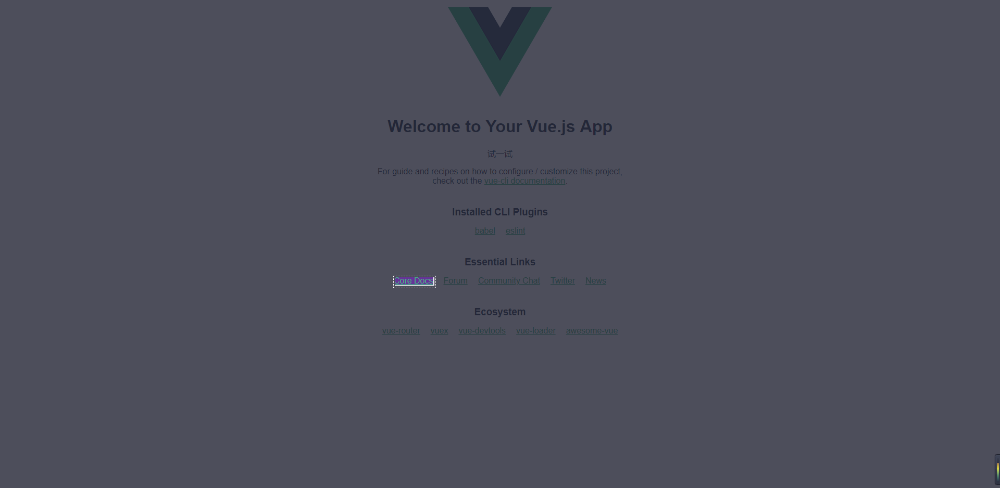

# vue-highlight

尝试构建一款可以实现vue元素遮罩高亮的组件。目前想到的有几种方案，但是各有各的利弊。

## z-index方案

采用一个充满父元素的div

```css
{
    position: fixed;
    z-index: 1000; // 高于原先父元素即可
    background: rgba(33, 34, 50, 0.8);
    width: 100%;
    height: 100%;
}
```

然后通过将目标元素的层级(z-index)设为高于遮罩层，显示高亮。但是这里有个问题，就是如果要让目标元素的z-index起作用。对目标元素和目标元素的父元素要求是比较多的，比如对目标元素本身的定位要求、不可浮动、对父元素的定位要求。在比较理想的情况下，是可以使用这种方案。但是很多情况下都不是非常通用。

另外，如果想要禁用目标元素的鼠标点击事件可以采用将css中`pointer-events`设为none的方法。

代码：[highlight](https://github.com/will4906/vue-highlight/blob/master/src/highlight/index.vue)

## 多div拼接方案

我们设定上、中、下、左、右共5个div围绕拼接成一个遮罩层。其中，上下左右div的样式为遮罩样式。

```css
{
    background: rgba(33, 34, 50, 0.8);
}
```

而中为透明或加高亮透明样式。

```css
{
    outline: 1px dashed #ffffff;
    border: 2px solid #4a4b58;
}
```

这种方案的关键在于需要获取目标dom的定位和宽高，可以使用`getBoundingClientRect()`方法获取。从而计算出每个div的定位和宽高。这种方案可以解决'z-index方案'中对元素定位要求的问题，无论定位如何都可以实现高亮。但是这种方法也是有明显缺陷的：

1. 多目标元素高亮很难实现;
2. 一旦目标dom有定位或宽高改变无法及时跟踪，需要外部通知改变;
3. 对元素的可视性有一定要求，有些不可见情况下是获取不到宽高的;

代码：[highlight2](https://github.com/will4906/vue-highlight/blob/master/src/highlight/index2.vue)

## canvas方案

利用canvas进行绘制，本质的原理和div方案是相似的，获取目标的宽高和定位再进行绘制。

缺点：

* 依旧需要手动更新dom
* 对元素可视性有一定要求
* 浏览器兼容性不一定好

优点：

* 可以实现多目标元素高亮
* 不会大规模影响目标元素

## 效果



## 参考

* z-index作用问题：
    * https://shiyousan.com/post/635861461562038949
    * https://www.jianshu.com/p/fb0a13c6e957
* css边框问题：http://tianshu.xyz/blog/116/
* flex布局：http://www.ruanyifeng.com/blog/2015/07/flex-grammar.html
